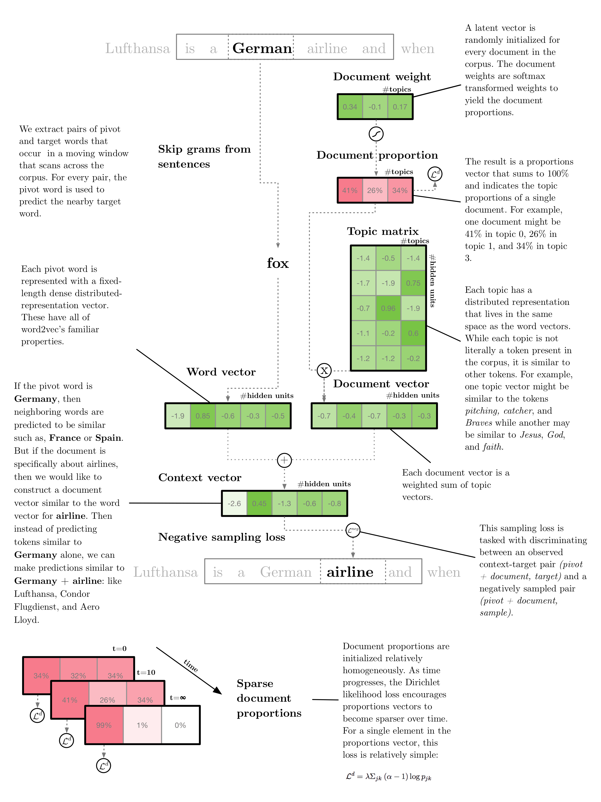

# lda2vec: Marriage of word2vec and lda


# lda2vec
The lda2vec model tries to mix the best parts of word2vec and LDA into a single framework. word2vec captures powerful relationships between words, but the resulting vectors are largely uninterpretable and don't represent documents. LDA on the other hand is quite interpretable by humans, but doesn't model local word relationships like word2vec. We build a model that builds both word and document topics, makes them interpretable, makes topics over clients, times, and documents, and makes them supervised topics.

This repo is a `pytorch` implementation of Moody's lda2vec (implemented in chainer), a way of topic modeling using word embeddings.  
The original paper:
[Mixing Dirichlet Topic Models and Word Embeddings to Make lda2vec](https://arxiv.org/abs/1605.02019).

**Warning:**

As the authour said, lda2vec is a big series of experiments. It is still a research software. However, the author doesn't want to discourage experimentation!

I use vanilla LDA to initilize lda2vec (topic assignments for each document). **It is not like in the original paper.** Without this initial topic assignment, results are bad.


## How to use it
1. There is one important hyper parameter, N_TOPICS in prepare.py. Modify it as you want.
2. Run `python main.py` to train.
3. Go to `explore/`
4. Run `explore_model.ipynb` to explore a trained model.

## When you want to change N_TOPICS
1. Remove all files in ./npy `rm -f npy/*`
2. Remove all files in ./checkpoint `rm -f checkpoint/*`
3. Run `python main.py` to train.

## Training dataset description
I use 20newsgroups from sklearn datasets.
```
from sklearn.datasets import fetch_20newsgroups

dataset = fetch_20newsgroups(subset='all', remove=('headers', 'footers', 'quotes'))
```
To stem all tokens in the dataset, I use elasticsearch analyzer. Check that minimal_english stemmer is used here.
```
PUT l2v_analyzer_index
{
  "settings" : {
      "index" : {
        "analysis" : {
          "filter" : {
            "english_stemmer" : {
              "type" : "stemmer",
              "language" : "minimal_english"
            },
            "english_stop" : {
              "type" : "stop",
              "stopwords" : "_english_"
            }
          },
          "analyzer" : {
            "rebuilt_english" : {
              "filter" : [
                "lowercase",
                "english_stop",
                "english_stemmer"
              ],
              "tokenizer" : "standard"
            }
          }
        }
      }
    }
}
```
After 20newsgroups dataset from sklearn passed to above analyzer, contents are stored in `data/newsgroups_texts.json`

## 2017년 네이버 뉴스 (total 14GB) 이용하여 학습한 결과 탐색 {Exploration of a trained model using 2017 navernews (total 14GB) dataset}
14GB 텍스트 데이터에 학습된 모델을 탐색해보기 위해서 `explore/explore_2017navernews.ipynb` 확인 해주세요. **위의 노트북 파일은 읽기 전용입니다.**
